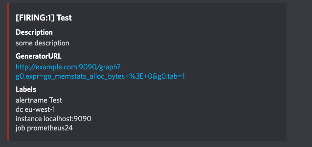

Alertmanager -> Discord Webhook
============================
Recieves webhook from alert-manager and routes it to Discord.



### Using the service
```
go build
./alertmanager-discord --webhook <webhook-url>
curl -X POST -H "Content-Type: application/json" -d @example/alert-manager.json  127.0.0.1:9094/alerts
```

### Using
```
# The root route on which each incoming alert enters.
route:
  group_by: ['alertname']
  group_wait: 20s
  group_interval: 5m
  repeat_interval: 3h
  receiver: discord_webhook

receivers:
- name: 'discord_webhook'
  webhook_configs:
  - url: 'http://localhost:9094'
```

See [LICENSE](./LICENSE)
